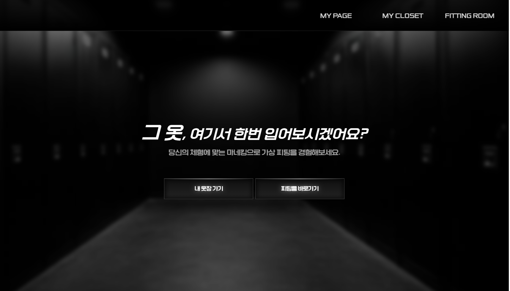
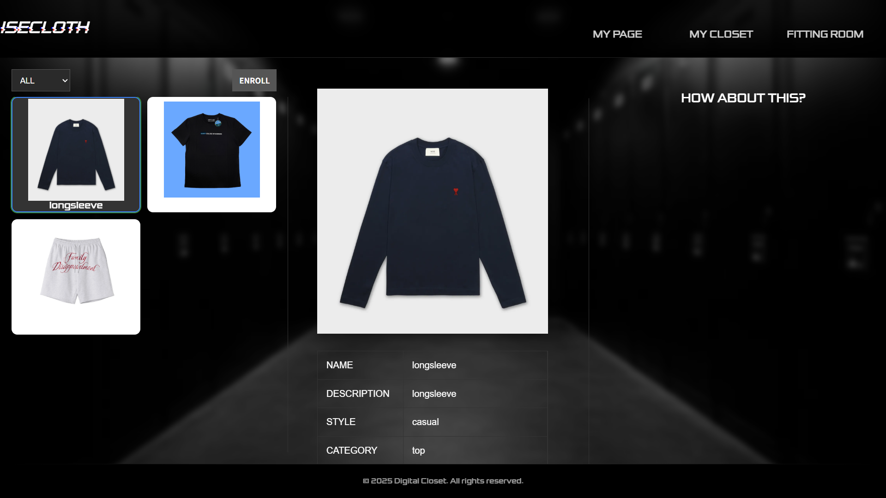
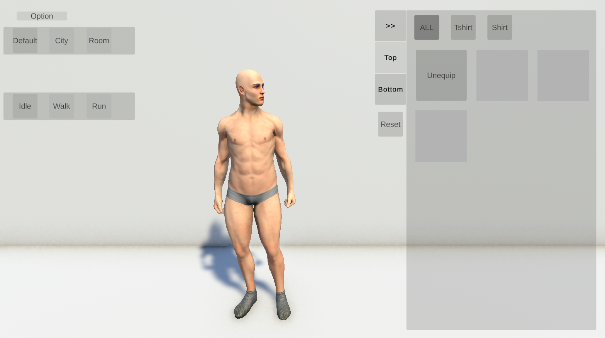
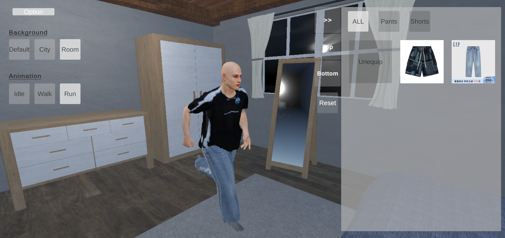

# 이세옷 (이세계옷장)

<div align="center">
  
</div>

## Contents

- 📖 Introduction
- ✨ Features
- 🖼️ Preview
- 🛠️ Tech Stack
- 🏗️ Structure
- 📄 License

## 📖 Introduction
이세옷은 사용자의 퍼스널 체형을 기반으로 한 3D 가상 피팅 서비스입니다. 자신의 신체 사이즈에 맞춰 생성된 아바타를 통해, 실제 옷을 입어보지 않고도 다양한 옷을 가상으로 피팅해볼 수 있는 새로운 경험을 제공합니다.

## ✨ Features

### • 퍼스널 체형 기반 아바타 생성
1. **전신 사진 업로드**: 한 장의 전신 사진 입력  
&nbsp;&nbsp;&nbsp;&nbsp;&nbsp;&nbsp;&nbsp;&nbsp;&nbsp;&nbsp;&nbsp;&nbsp;&nbsp;&nbsp;&nbsp;&nbsp;&nbsp;&nbsp;&nbsp;&nbsp;&nbsp;&nbsp;&nbsp;&nbsp;&nbsp;&nbsp;&nbsp;&nbsp;&nbsp;&nbsp;⬇️
2. **SMPL 모델 추정**: AI 기반으로 정확한 체형 분석  
&nbsp;&nbsp;&nbsp;&nbsp;&nbsp;&nbsp;&nbsp;&nbsp;&nbsp;&nbsp;&nbsp;&nbsp;&nbsp;&nbsp;&nbsp;&nbsp;&nbsp;&nbsp;&nbsp;&nbsp;&nbsp;&nbsp;&nbsp;&nbsp;&nbsp;&nbsp;&nbsp;&nbsp;&nbsp;&nbsp;⬇️
3. **UMA 파라미터 변환**: 체형과 맞는 3D 아바타 생성  
&nbsp;&nbsp;&nbsp;&nbsp;&nbsp;&nbsp;&nbsp;&nbsp;&nbsp;&nbsp;&nbsp;&nbsp;&nbsp;&nbsp;&nbsp;&nbsp;&nbsp;&nbsp;&nbsp;&nbsp;&nbsp;&nbsp;&nbsp;&nbsp;&nbsp;&nbsp;&nbsp;&nbsp;&nbsp;&nbsp;⬇️
4. **실시간 렌더링**: 즉시 확인 가능한 나만의 아바타
<br>

### • 3D 의류 생성 및 가상 피팅
1. **의류 사진 분석**: 앞/뒤 사진으로 의류의 모든 디테일 캡처  
&nbsp;&nbsp;&nbsp;&nbsp;&nbsp;&nbsp;&nbsp;&nbsp;&nbsp;&nbsp;&nbsp;&nbsp;&nbsp;&nbsp;&nbsp;&nbsp;&nbsp;&nbsp;&nbsp;&nbsp;&nbsp;&nbsp;&nbsp;&nbsp;&nbsp;&nbsp;&nbsp;&nbsp;&nbsp;&nbsp;⬇️
2. **자동 배경 제거**: U-2-Net 기반 정확한 의류 분리  
&nbsp;&nbsp;&nbsp;&nbsp;&nbsp;&nbsp;&nbsp;&nbsp;&nbsp;&nbsp;&nbsp;&nbsp;&nbsp;&nbsp;&nbsp;&nbsp;&nbsp;&nbsp;&nbsp;&nbsp;&nbsp;&nbsp;&nbsp;&nbsp;&nbsp;&nbsp;&nbsp;&nbsp;&nbsp;&nbsp;⬇️
3. **텍스처 생성**: Cloth2Tex로 현실적인 의류 텍스처 구현  
&nbsp;&nbsp;&nbsp;&nbsp;&nbsp;&nbsp;&nbsp;&nbsp;&nbsp;&nbsp;&nbsp;&nbsp;&nbsp;&nbsp;&nbsp;&nbsp;&nbsp;&nbsp;&nbsp;&nbsp;&nbsp;&nbsp;&nbsp;&nbsp;&nbsp;&nbsp;&nbsp;&nbsp;&nbsp;&nbsp;⬇️
4. **실시간 피팅**: 아바타에 즉시 적용되는 가상 착용 경험
<br>

### • 인터랙티브 경험
- **다양한 배경**: 여러 환경에서 의상 확인
- **동적 모션**: 실제 움직임을 시뮬레이션한 아바타 애니메이션
- **360도 뷰**: 모든 각도에서 의상 확인 가능


## 🖼️ Preview

<div align="center">

### MY CLOSET 화면  


### 기본 옷장 화면


### 아바타 피팅 데모


</div>

## 🛠️ Tech Stack

### 🖥️ Frontend
<div>
  
  
</div>

### ⚙️ Backend
<div>
  
  
  
</div>

### 🗄️ Database
<div>
  
</div>

### 🤖 AI/ML
<div>
  
  
</div>

### 🎮 3D Graphics
<div>
  
  
  
</div>

### 🤝 Collaboration
<div>
  
  
</div>

### 🚀 Deployment
<div>
  
  
</div>

## 🏗️ Structure

### 🔧 프로젝트 아키텍처

```
┌─────────────────┐    ┌──────────────────┐    ┌─────────────────┐
│    Frontend     │    │     Backend      │    │    AI Server    │
│     (React)     │◄──►│ (Node.js+Express)│◄──►│    (FastAPI)    │
│                 │    │                  │    │                 │
│ • My Page       │    │ • Outfit API     │    │ • SMPLify-X     │
│ • My Closet     │    │ • Mannequin API  │    │ • U-2-Net       │
│ • Fiting Room   │    └──────────────────┘    │ • Cloth2Tex     │
└─────────────────┘              │             │ • PyMAF-X       │
                                 │             └─────────────────┘
                                 │           
                  ┌──────────────────────────────┐
         ┌─────────────────┐            ┌─────────────────┐              
         │      Unity      │            │    MongoDB      │              
         │     (WebGL)     │            │                 │
         │                 │            │ • User Data     │               
         │ • OutfitLoader  │            │ • Avatar Data   │              
         │ • Avatar Loader │            │ • Cloth Data    │              
         └─────────────────┘            └─────────────────┘
```

### 📊 데이터 플로우


#### 아바타 생성
```
User Input (전신사진) 
            ↓
AI Processing (SMPL 추정)
            ↓
UMA DNA Converter (SMPL 베타값 ─► UMA DNA 파라미터)
            ↓  
Avatar Generation (UMA 파라미터 적용)
```

#### 옷 텍스처 생성
```
Cloth Input (옷 앞/뒤 사진)
                ↓
Image Processing (rembg[배경제거], Landmark detection[특징점 검출], U-2-Net[마스킹])
                ↓
Texture Generation (Cloth2Tex)
                ↓
3D Virtual Fitting (템플릿 메쉬에 텍스처 적용)
```

## 📄 License

이 프로젝트는 여러 오픈소스 AI 모델과 라이브러리를 사용하고 있으며, 각각 다른 라이선스가 적용됩니다:

### Third-Party AI Models

**1. U-2-Net**
- **License**: Apache License 2.0
- **Repository**: https://github.com/xuebinqin/U-2-Net
- **Purpose**: 배경 제거 및 이미지 마스킹

**2. Cloth2Tex**
- **License**: 별도 명시되지 않음 (일반적으로 연구용)
- **Repository**: https://github.com/HumanAIGC/Cloth2Tex
- **Purpose**: 의류 텍스처 생성

**3. SMPLify-X**
- **License**: 비상업적 과학 연구 목적 전용 라이선스 (Max-Planck-Gesellschaft)
- **Repository**: https://github.com/vchoutas/smplify-x
- **Purpose**: 3D 인체 모델 파라미터 추정
- **중요**: 상업적 사용을 위해서는 별도 라이선스 필요 (sales@meshcapade.com)

**4. PyMAF-X**
- **License**: 별도 명시되지 않음 (일반적으로 연구용)
- **Repository**: https://github.com/HongwenZhang/PyMAF-X
- **Purpose**: 단안 이미지로부터 전신 모델 회귀

### License Compatibility Notice

⚠️ **중요 고지사항**: 이 프로젝트는 상업적 사용이 제한된 AI 모델들을 포함하고 있습니다. 특히 SMPLify-X는 비상업적 과학 연구, 교육, 또는 예술적 프로젝트 목적으로만 사용 가능하며, 상업적 사용을 위해서는 Meshcapade를 통한 별도 라이선스가 필요합니다.

### Recommended License for This Project

위의 제약사항을 고려하여, 본 프로젝트는 **연구 및 교육 목적으로만 사용**하는 것을 권장합니다. 상업적 사용을 고려하신다면:

1. SMPLify-X에 대한 상업적 라이선스 획득 (sales@meshcapade.com)
2. 다른 제한적 라이선스 모델들에 대한 별도 허가 확인
3. 해당 모델들을 대체할 수 있는 상업적 사용 가능한 대안 모델 검토

### MIT License (for Original Code)

본 프로젝트의 오리지널 코드 부분은 MIT License 하에 배포됩니다:

```
MIT License

Copyright (c) [년도] [프로젝트 소유자명]

Permission is hereby granted, free of charge, to any person obtaining a copy
of this software and associated documentation files (the "Software"), to deal
in the Software without restriction, including without limitation the rights
to use, copy, modify, merge, publish, distribute, sublicense, and/or sell
copies of the Software, and to permit persons to whom the Software is
furnished to do so, subject to the following conditions:

The above copyright notice and this permission notice shall be included in all
copies or substantial portions of the Software.

THE SOFTWARE IS PROVIDED "AS IS", WITHOUT WARRANTY OF ANY KIND, EXPRESS OR
IMPLIED, INCLUDING BUT NOT LIMITED TO THE WARRANTIES OF MERCHANTABILITY,
FITNESS FOR A PARTICULAR PURPOSE AND NONINFRINGEMENT. IN NO EVENT SHALL THE
AUTHORS OR COPYRIGHT HOLDERS BE LIABLE FOR ANY CLAIM, DAMAGES OR OTHER
LIABILITY, WHETHER IN AN ACTION OF CONTRACT, TORT OR OTHERWISE, ARISING FROM,
OUT OF OR IN CONNECTION WITH THE SOFTWARE OR THE USE OR OTHER DEALINGS IN THE
SOFTWARE.
```

---

**참고**: 사용하시기 전에 각 모델의 라이선스 조건을 반드시 확인하시고, 상업적 사용 시에는 법적 검토를 받으시기 바랍니다.
